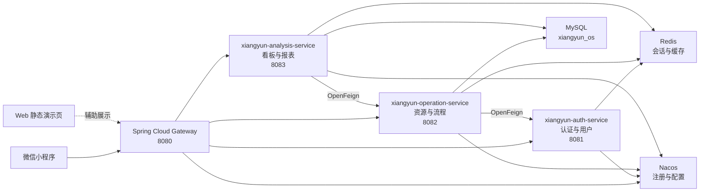
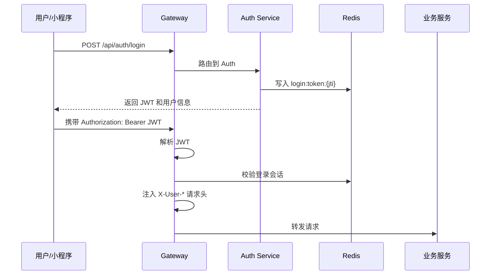
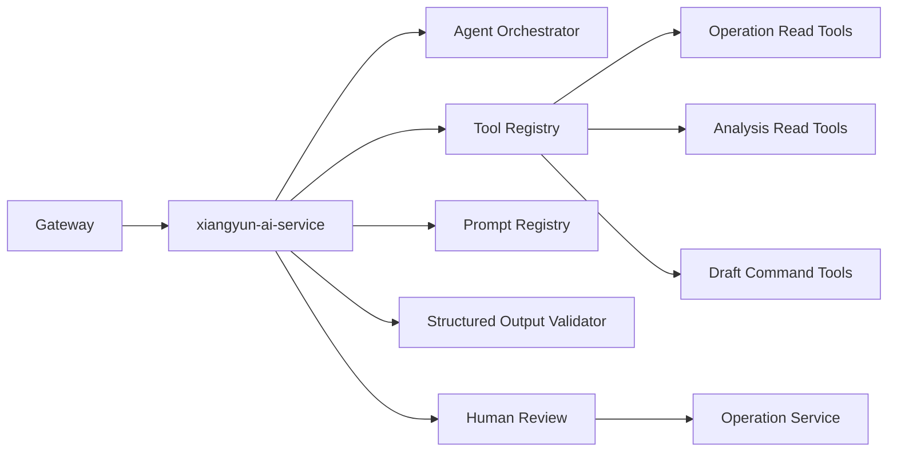

# 乡耘 OS 架构与技术要点梳理

## 1. 文档定位

本文档用于梳理 `Rural-revitalization-OS / Xiangyun OS` 当前版本的整体架构、业务逻辑、技术实现要点与后续演进方向。内容以当前仓库实际代码为准，适合用于项目答辩、技术方案说明、后续开发交接和 V1.2 架构规划。

当前系统已经从早期的单体演示形态，演进为“微信小程序 + Spring Cloud Gateway + 多业务服务 + Redis + MySQL + Nacos”的轻量分布式乡村振兴资源运营平台。

## 2. 系统定位

乡耘 OS 面向乡村资源盘活、招商协同和运营分析场景，核心目标不是单纯展示数据大屏，而是支撑乡村运营人员完成日常业务闭环：

- 资源建档：管理闲置空间、文旅点位、农产品、合作项目等乡村资源。
- 资源招商：维护资源状态、招商状态、投资匹配和合作申请。
- 协同审批：处理合作申请、审批流程、待办任务和流程归档。
- 运营分析：汇总资源、流程、客流、营收、风险和趋势预测。
- 智能辅助：后续通过 AI Agent 提供摘要、检查、推荐、提醒和周报能力。

系统当前更适合被定义为“乡村资源运营与协同平台”，AI 能力应作为业务流程中的副驾驶，而不是绕过业务服务的自动决策者。

## 3. 总体架构

当前项目由三类前端/展示入口和五个后端模块组成。



### 3.1 前端层

微信小程序是当前主入口，位于 `miniprogram/`。小程序包含启动页、登录注册、首页看板、资源地图、资源详情、协同工作台、流程详情、智能报表、招商匹配和趋势预测等页面。

当前小程序默认使用真实 API：

```text
dataSource = api
baseURL = http://127.0.0.1:8080/api
```

这意味着演示时必须先启动 Gateway 及相关后端服务。mock 数据仍保留，用于离线演示或接口不可用时的开发兜底。

### 3.2 网关层

`xiangyun-gateway` 是后端唯一公开入口，端口为 `8080`。它承担：

- API 路由转发。
- JWT 校验。
- Redis 会话校验。
- 用户身份头注入。
- 基础权限控制。
- TraceId 注入。
- 禁止外部访问 `/api/internal/**` 内部接口。

网关通过 Nacos 服务发现，将请求转发至 Auth、Operation、Analysis 三个业务服务。

### 3.3 认证服务

`xiangyun-auth-service` 负责用户、角色和登录会话管理，端口为 `8081`。主要能力包括：

- 登录、注册、登出。
- JWT 签发与用户信息返回。
- Redis 登录会话写入。
- 用户和角色管理。
- 内部用户摘要接口，供 Operation 服务通过 Feign 调用。

当前 Demo 账号包括：

| 用户名 | 角色 | 说明 |
| --- | --- | --- |
| `user_demo` | USER | 小程序普通用户 |
| `staff_demo` | STAFF | 运营/审批人员 |
| `admin` | ADMIN | 管理员 |

### 3.4 运营服务

`xiangyun-operation-service` 是业务主服务，端口为 `8082`。它负责资源、乡村、流程、审批、待办等操作型业务。

核心职责：

- 乡村基础数据管理。
- 资源列表、地图点位、资源详情。
- 资源发布、下架、招商状态更新。
- 合作申请提交。
- 我的申请、审批列表、流程详情。
- 流程动作处理。
- 待办和归档。
- 向 Analysis 服务提供内部统计数据。

该服务是当前业务闭环的核心，所有关键写操作都应尽量沉淀在 Operation 服务中，而不是由前端、Analysis 或后续 AI 服务直接改库。

### 3.5 分析服务

`xiangyun-analysis-service` 负责看板、报表、预测和招商匹配分析，端口为 `8083`。

核心职责：

- 首页运营看板。
- 报表 dashboard。
- 客流、营收、比例、趋势等分析数据。
- 趋势预测。
- 招商匹配视图。
- Dashboard 缓存和兜底缓存。
- 通过 Feign 调用 Operation 获取资源与运营统计。

Analysis 服务当前实现了缓存命中、缓存未命中重算、失败后返回 last-success 兜底缓存的机制。这个方向是正确的，但后续需要进一步标注缓存生成时间、数据范围和最大可接受陈旧时间。

### 3.6 公共模块

`xiangyun-common` 提供跨服务共用能力：

- `ApiResponse` 统一响应结构。
- `JwtUtils` 与 `TokenPayload`。
- `SecurityHeaders` 用户上下文头。
- 公共 DTO。
- 通用异常与安全相关工具。

## 4. 核心业务逻辑

### 4.1 登录与鉴权链路



当前权限控制主要在 Gateway 层完成：

- `/api/auth/login`、`/api/auth/register` 为公开接口。
- `/api/users/**`、`/api/roles/**` 需要 ADMIN。
- `/api/dashboard/refresh` 需要 ADMIN。
- 流程审批和流程动作类写操作需要 STAFF 或 ADMIN。
- `/api/internal/**` 禁止外部访问。

后续生产化时，不能只依赖 Gateway。业务服务端口应在网络层隐藏，并增加内部身份签名、mTLS 或短期内部 JWT 校验。

### 4.2 资源运营链路

资源运营是系统的主业务对象，典型链路为：

```text
资源建档 -> 资源状态维护 -> 发布/下架 -> 招商状态更新 -> 合作申请 -> 审批流转 -> 项目跟进 -> 运营复盘
```

当前已覆盖：

- 资源列表与详情。
- 地图点位。
- 资源标签。
- 发布与下架。
- 招商状态更新。
- 合作申请提交。
- 资源关联申请数。
- 招商匹配视图。

后续应重点补齐：

- 资源档案版本。
- 资源材料附件。
- 权属和材料核验记录。
- 资源变更审计。
- 现场采集数据。

### 4.3 协同审批链路

协同模块围绕合作申请和审批处理展开：

```text
用户提交合作申请
-> Operation 创建流程与待办
-> STAFF/ADMIN 审批
-> 流程状态变更
-> 记录审批动作
-> 看板和报表同步体现
```

当前系统已经具备工作台、我的申请、审批历史、流程详情和审批动作接口。后续如果引入消息队列，应使用 Outbox 保障“业务状态变更”和“事件发布”的一致性。

### 4.4 运营分析链路

Analysis 服务不直接承担核心业务写入，主要负责读、聚合和分析：

```text
请求看板
-> 查询 Redis 主缓存
-> 缓存命中直接返回
-> 缓存未命中调用 Operation 获取统计
-> 查询报表快照表
-> 聚合结果
-> 写入 Redis 主缓存和 last-success 兜底缓存
```

这种设计可以降低 Operation 服务压力，并提升小程序首页加载稳定性。

## 5. 数据与存储设计

### 5.1 MySQL

当前 Demo 使用一个物理数据库 `xiangyun_os`。Operation 和 Analysis 均连接该数据库，但各自通过独立 Flyway 历史表维护迁移记录：

- Operation：`flyway_operation_history`
- Analysis：`flyway_analysis_history`

当前设计适合课程/比赛 Demo。生产演进建议分阶段实施：

1. 单实例多 Schema：不同服务使用独立 schema 和账号。
2. 服务边界稳定后，再考虑物理库拆分。
3. 避免一开始维护多个数据库实例，降低运维复杂度。

### 5.2 Redis

Redis 当前用于：

- 登录会话。
- Dashboard 缓存。
- 资源详情缓存。
- last-success 兜底缓存。

缓存策略应遵循：

- 主缓存设置较短 TTL。
- 兜底缓存设置最大陈旧时间。
- 返回陈旧数据时应明确标识 `STALE`。
- 页面应展示数据生成时间，避免把历史缓存伪装为实时数据。

### 5.3 Nacos

Nacos 当前承担服务注册与可选配置中心能力。各服务通过：

```text
spring.config.import = optional:nacos:${spring.application.name}.yml
```

加载远程配置。Demo 环境允许没有 Nacos 配置文件时回退本地配置。

## 6. 接口与服务边界

当前 API 按领域分布：

| 领域 | 服务 | 典型接口 |
| --- | --- | --- |
| 认证与用户 | Auth | `/api/auth/login`, `/api/auth/me`, `/api/users`, `/api/roles` |
| 资源运营 | Operation | `/api/resources`, `/api/resources/{id}`, `/api/resources/map-points` |
| 协同流程 | Operation | `/api/workflows/workbench`, `/api/workflows/processes/{id}`, `/api/workflows/approvals` |
| 看板报表 | Analysis | `/api/dashboard`, `/api/reports/dashboard`, `/api/reports/forecast` |
| 内部调用 | Operation/Auth | `/api/internal/**` |

服务边界原则：

- Auth 只负责身份、用户和角色。
- Operation 负责核心业务状态。
- Analysis 负责分析聚合和读模型。
- Gateway 负责外部入口和横切校验。
- 后续 AI Service 不应直接写业务库，只能通过受控工具或业务 API 生成草稿和建议。

## 7. 技术栈

### 7.1 后端

- Java 17
- Spring Boot 3.3.4
- Spring Cloud 2023.0.3
- Spring Cloud Alibaba 2023.0.3.3
- Spring Cloud Gateway
- OpenFeign
- Nacos
- Redis
- MySQL 8.4
- Flyway
- Springdoc OpenAPI
- JUnit 5 / Mockito

### 7.2 前端

- 微信小程序原生框架
- TypeScript
- SCSS
- 自定义组件体系
- service 层封装 API 与 mock 切换

### 7.3 基础设施

`docker-compose.demo.yml` 提供：

- MySQL：`3307 -> 3306`
- Redis：`6379`
- Nacos：`8848`、`9848`

## 8. 当前技术亮点

### 8.1 轻量分布式架构

项目不是停留在单体接口模拟，而是已经拆分出 Gateway、Auth、Operation、Analysis 和 Common 模块。服务通过 Nacos 注册，通过 Gateway 统一暴露，通过 Feign 实现内部服务协作。

### 8.2 统一认证与会话校验

系统采用 JWT + Redis session 的组合：

- JWT 用于无状态身份载荷。
- Redis 用于会话有效性控制。
- Gateway 统一校验并注入可信用户上下文。
- 登出时清理 Redis session。

该方案比单纯 JWT 更容易支持踢下线、会话失效和多端管理。

### 8.3 读写职责初步分离

Operation 承担业务写入与状态变更，Analysis 承担读模型聚合、报表和趋势分析。虽然当前仍共享一个数据库，但服务职责已经开始分离。

### 8.4 缓存降级设计

Analysis 首页看板支持：

- Redis 主缓存。
- 缓存未命中后重算。
- 失败时返回 last-success 兜底缓存。
- `HIT / MISS / STALE` 状态标识。

这是向生产可用性靠拢的设计。

### 8.5 小程序 service 层隔离

小程序没有直接在页面中拼接后端细节，而是通过 `services/` 和 `utils/request.ts` 统一处理：

- API 地址构造。
- Token 注入。
- 401 重新登录。
- 统一响应解析。
- mock/api 模式切换。
- 网络错误文案归一化。

这为后续接口调整和字段适配留出了空间。

## 9. 当前问题与风险

### 9.1 文档口径新旧混杂

仓库已将早期单体架构说明和旧 mock 对接文档移除，当前文档口径应保持一致：

- 当前正式后端以 `backend/xiangyun-*` 多模块为准。
- `docs/distributed-architecture.md` 和本文档作为当前架构主说明。

### 9.2 中文编码显示问题

部分 Java 字符串或文档在终端中出现乱码显示。需要区分：

- 文件本身编码损坏。
- PowerShell 显示编码问题。
- 源码中已经写入了乱码文本。

若源码中实际存在乱码，应优先修复返回给前端的中文文案，否则会影响小程序展示和答辩演示观感。

### 9.3 服务直连风险

Demo 环境中各业务服务端口均暴露在本机。生产环境不能让用户绕过 Gateway 直接访问 `8081/8082/8083`。后续应通过网络层限制内部服务端口，并增加服务间身份校验。

### 9.4 数据隔离仍处于 Demo 阶段

当前多个服务共享一个 MySQL 数据库。对于课程 Demo 可接受，但生产演进应逐步过渡到：

- 独立 schema。
- 独立数据库账号。
- 跨领域数据通过 API 或事件同步。

### 9.5 审计与幂等需要加强

当前已有部分接口支持 `Idempotency-Key`，但关键写操作仍需系统化补齐：

- 请求幂等。
- 操作审计。
- 状态机校验。
- 操作人、操作时间、操作前后状态记录。

## 10. AI Agent 演进建议

AI Agent 应定位为“可靠副驾驶”，不应成为直接修改核心业务状态的自动执行者。

### 10.1 优先建设的 Agent

首期建议只做低风险、可解释、可人工确认的 Agent：

1. `WeeklyReportAgent`：根据报表数据生成运营周报草稿。
2. `DataQualityAgent`：检查资源档案缺失、长期未更新、异常面积、缺少联系人等问题。
3. `FollowUpCopilot`：根据招商跟进口述生成摘要、待办和下次跟进建议。

### 10.2 暂缓建设的 Agent

以下能力应暂缓：

- 自动审批。
- 自动变更项目阶段。
- 自动确认资源权属。
- 自动签约或合同判断。
- 多 Agent 自主协作。
- 直接写业务数据库。

### 10.3 推荐 AI 架构

后续可新增 `xiangyun-ai-service`：



关键原则：

- Agent 默认只读。
- 写操作只生成 draft。
- 人工确认后由 Operation Service 执行业务命令。
- 所有 Agent 输入、输出、工具调用和人工确认都进入审计。
- 不保存模型内部推理过程，只保存输入摘要、工具调用摘要、最终输出和确认结果。

## 11. 后续演进路线

### 11.1 第一阶段：当前项目收口

- 统一文档口径。
- 明确当前多服务架构为主线。
- 修复中文乱码和展示文案。
- 保证小程序端到端演示稳定。
- 补充关键接口说明和演示脚本。
- 保持 `mvn test` 全量通过。

### 11.2 第二阶段：真实业务闭环

- 完善资源档案 V2。
- 增加材料、现场采集、联系人和权属核验记录。
- 完善合作申请和审批状态机。
- 增加审计日志。
- 强化幂等和权限校验。
- 报表展示数据生成时间和数据范围。

### 11.3 第三阶段：事件驱动

如引入 RabbitMQ，应同步建设：

- Outbox 表。
- Outbox Publisher。
- Publisher Confirm。
- Inbox 去重。
- Manual ACK。
- 重试和死信队列。
- 事件版本号。
- 事件监控。

不要在数据库事务中直接发送 MQ 消息。

### 11.4 第四阶段：AI Agent MVP

优先落地：

- 周报草稿。
- 数据质量检查。
- 招商跟进摘要。

这一阶段不建议引入多 Agent 自主编排，也不建议同时维护 Spring AI 与 LangChain4j。由于当前项目是 Spring 技术栈，首期更适合选择 Spring AI。

### 11.5 第五阶段：知识库与多模态

在业务闭环稳定后，再引入：

- 政策知识库。
- PostgreSQL + pgvector。
- 材料 OCR。
- ResourceMaterialAssistant。
- MatchExplanationAgent。
- Agent 评测集和上线门槛。

## 12. 当前推荐结论

当前乡耘 OS 已经具备较完整的轻量分布式 Demo 基础。下一步不宜继续盲目增加基础设施，而应围绕“真实运营闭环”收口：

- 业务上，优先打通资源建档、招商申请、审批流转和运营报表。
- 技术上，巩固 Gateway、Auth、Operation、Analysis 的服务边界。
- 数据上，补齐审计、幂等、缓存生成时间和关键状态机。
- AI 上，坚持副驾驶原则，先做草稿、检查、摘要和建议，不做自动决策。

项目最有价值的演进方向，是从“能演示的乡村振兴平台”升级为“运营人员每天能使用的乡村资源运营系统”，再逐步叠加可靠、可审计、可确认的智能辅助能力。
