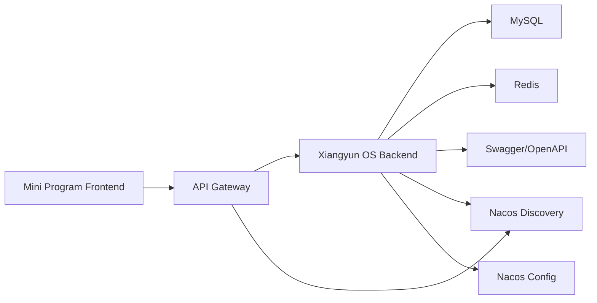

# Xiangyun OS Final Demo Implementation

> This file is superseded by `docs/distributed-architecture.md`.
> The final implementation is a real lightweight distributed platform with Gateway, Nacos, three business services, OpenFeign, Redis, and MySQL.

## Goal

This project is a Spring Boot 3 based distributed rural revitalization information system demo. It keeps the frontend and backend separated:

- Frontend: WeChat Mini Program under `miniprogram/`
- Backend API: Spring Boot 3 service under `backend/`
- Database: MySQL with Flyway migration scripts
- Cache middleware: Redis, demonstrated through `/api/infra/redis/*`
- API documentation: Springdoc Swagger UI at `/api/swagger-ui.html`
- Distributed demo components: gateway, registry, and config center are represented by demo endpoints under `/api/infra/*`; in a fuller deployment these map to Spring Cloud Gateway and Nacos.

## Architecture



## Implemented Demo Scope

- Login authentication demo: `/api/auth/login`, `/api/auth/me`, `/api/auth/refresh`, `/api/auth/logout`
- Dashboard module: overview, stats, trends, risks, AI suggestions, village profile
- Resource module: resource list/detail, map points, tags, categories, publish/offline, investment matches
- Workflow module: workbench, todos, approvals, process detail, process action, archive, messages
- Report module: dashboard, summary, visitor trends, revenue charts, auto summary, forecast, export, KPI progress
- Infra module: health, Redis ping/cache set/get/delete, registry status, service list, gateway routes, config values and refresh demo

The backend now exposes more than 50 Swagger-visible API endpoints for the final project requirement.

## How To Run Backend

1. Start MySQL and create database/user according to `backend/src/main/resources/application-dev.yml`.
2. Start Redis on `127.0.0.1:6379`.
3. Run backend:

```bash
cd backend
mvn spring-boot:run
```

4. Open:

```text
http://127.0.0.1:8088/api/swagger-ui.html
```

Optional infrastructure startup:

```bash
docker compose -f docker-compose.demo.yml up -d
```

## What To Show In The Video

1. Explain architecture:
   - Mini Program is the frontend.
   - Spring Boot 3 is the backend API service.
   - MySQL stores business data.
   - Redis is used as middleware for cache demonstration.
   - Swagger generates API documentation.
   - Gateway, registry, and config center are shown through infra endpoints and can be mapped to Spring Cloud Gateway plus Nacos in deployment.

2. Show login:
   - Call `POST /api/auth/login`.
   - Explain that the returned token represents the login authentication process.

3. Show API documentation:
   - Open Swagger UI.
   - Expand dashboard/resource/workflow/report/infra groups.
   - Mention total endpoint count is over 50.

4. Show Redis:
   - Call `GET /api/infra/redis/ping`.
   - Call `POST /api/infra/redis/cache/demo?value=hello`.
   - Call `GET /api/infra/redis/cache/demo`.

5. Show distributed components:
   - Call `/api/infra/registry/status`.
   - Call `/api/infra/registry/services`.
   - Call `/api/infra/gateway/routes`.
   - Call `/api/infra/config/current`.

6. Show business functions:
   - Dashboard: `/api/dashboard`
   - Resource map: `/api/resources/map-points`
   - Workflow workbench: `/api/workflows/workbench`
   - Report dashboard: `/api/reports/dashboard`
   - Forecast: `/api/reports/forecast`

7. Show tests:

```bash
cd backend
mvn test
```

Expected result:

```text
Tests run: 4, Failures: 0, Errors: 0, Skipped: 0
BUILD SUCCESS
```

## Current Tradeoff

To keep the final course demo practical before July 3, the system uses one runnable backend service plus separated frontend code. Distributed gateway/registry/config behavior is made demonstrable through infra endpoints and documented extension points. This is enough for a complete classroom demo while leaving a clean path to split the backend into independent microservices later.
