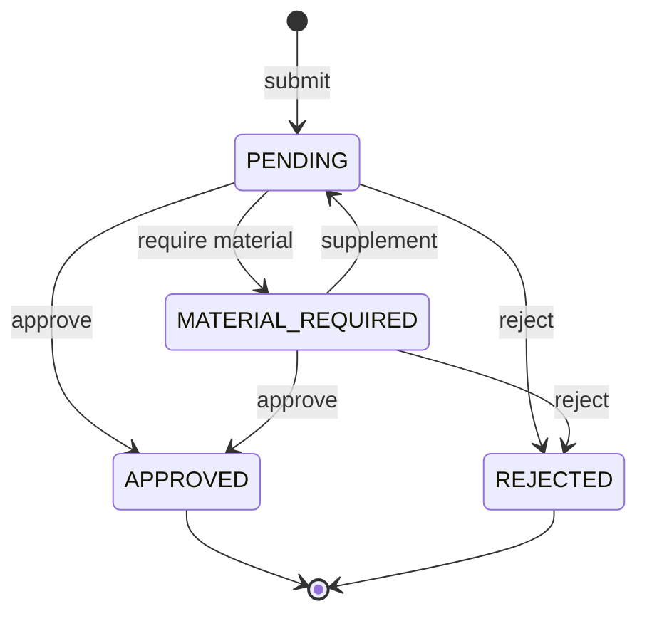

# 第二阶段业务闭环开发计划

## 1. 阶段目标

第二阶段目标是让乡耘 OS 从“能稳定演示”推进到“核心业务闭环真实可用”。本阶段不优先增加新基础设施，而是围绕资源、申请、审批、审计和报表联动补齐业务确定性。

核心闭环：

```text
资源档案
-> 合作申请
-> 待办生成
-> 审批处理
-> 状态更新
-> 审计记录
-> 我的申请/流程详情/报表可见
```

## 2. 当前已落地能力

### 2.1 合作申请

已支持：

- 小程序用户提交合作申请。
- `Idempotency-Key` 幂等保护。
- 同一用户对同一资源的待审批申请防重复。
- 申请成功后创建 `workflow`。
- 同步创建 `todo_item`。
- 写入 `operation_log` 审计记录。

### 2.2 审批处理

已支持：

- STAFF / ADMIN 审批。
- `PENDING -> APPROVED`。
- `PENDING -> REJECTED`。
- 已处理流程不能重复审批。
- 通过 `version` 做乐观锁保护。
- 审批记录写入 `approval_record`。
- 待办状态同步更新。
- 操作日志写入 `operation_log`。

### 2.3 查询与展示

已支持：

- `GET /api/workflows/my` 查询我的申请。
- 我的申请只关联最新审批记录，避免多条审批记录造成重复行。
- `GET /api/workflows/{id}` 查询流程详情。
- 流程详情返回处理记录的 `id`、`nodeId`、`operator`、`action`、`time`、`remark`。
- `GET /api/workflows/{id}/operation-logs` 查询操作日志。
- 资源详情返回权属状态、材料状态、现场图片和招商说明。
- 智能报表汇总合作申请数、审批通过率和超时待办数。
- 小程序协同工作台按角色展示：USER 查看我的申请，STAFF/ADMIN 处理待审批申请。

## 3. 第二阶段接口清单

| 能力 | 方法 | 路径 | 说明 |
| --- | --- | --- | --- |
| 提交合作申请 | POST | `/api/workflows/cooperation-applications` | 用户对资源提交合作申请 |
| 我的申请 | GET | `/api/workflows/my` | 当前用户提交过的申请 |
| 流程详情 | GET | `/api/workflows/{id}` | 申请详情、节点和审批记录 |
| 审批通过 | POST | `/api/workflows/{id}/approve` | STAFF/ADMIN 审批通过 |
| 审批驳回 | POST | `/api/workflows/{id}/reject` | STAFF/ADMIN 审批驳回 |
| 通用流程动作 | POST | `/api/workflows/processes/{id}/actions` | 支持 action 参数 |
| 补充材料 | POST | `/api/workflows/{id}/materials` | 用户补充材料后重新进入待审批 |
| 操作日志 | GET | `/api/workflows/{id}/operation-logs` | 查询业务审计轨迹 |

## 4. 状态机

当前状态机保持简单、可控：



暂不引入过多中间态。后续可在资源材料和归档流程稳定后扩展 `REVIEWING` 与 `ARCHIVED`。

## 5. 数据一致性要求

### 5.1 合作申请事务

提交申请必须在同一事务内完成：

- 插入 `workflow`。
- 插入 `todo_item`。
- 插入 `operation_log`。

任意一步失败，整体回滚。

### 5.2 审批事务

审批必须在同一事务内完成：

- 更新 `workflow` 状态。
- 更新 `todo_item` 状态。
- 插入 `approval_record`。
- 插入 `operation_log`。

任意一步失败，整体回滚。

### 5.3 并发审批

同一申请被多个审批人同时处理时，只允许一个成功。通过：

- `status = PENDING`
- `version = 当前版本`

共同控制并发写入。

## 6. 后续开发顺序

### 6.1 资源档案 V2

建议补充：

- 资源联系人。
- 权属状态。
- 材料状态。
- 现场图片。
- 资源更新时间。
- 招商说明。
- 推荐合作方向。

### 6.2 材料与补正

在当前状态机基础上增加：

```text
PENDING -> MATERIAL_REQUIRED -> PENDING
```

补齐：

- 补正原因。
- 材料清单。
- 用户补交入口。
- 补交后再次进入待审批。

### 6.3 审计日志前端展示

小程序流程详情页可展示：

- 提交申请。
- 审批通过/驳回。
- 操作人。
- 操作时间。
- 操作备注。

### 6.4 报表联动

Analysis 后续可增加：

- 申请数。
- 审批通过率。
- 平均审批耗时。
- 待审批超时数。
- 资源招商转化率。

## 7. 验收标准

第二阶段每个切片完成后，至少满足：

- 后端 `mvn test` 通过。
- 合作申请重复提交有明确处理。
- 审批重复操作会被拒绝。
- 审批记录和操作日志可追溯。
- 小程序“我的申请”和“流程详情”能看到最新状态。
- STAFF/ADMIN 可在协同工作台执行通过、驳回和要求补充材料。
- 业务状态只能由 Operation Service 修改。

## 8. 当前状态

第二阶段的轻量业务闭环已经完成：

- 资源档案 V2 字段已落库并在小程序资源详情页展示。
- 合作申请、审批、驳回、要求补材料、用户补材料已形成闭环。
- 流程详情页已展示审批记录和 `operation-logs` 操作日志。
- STAFF/ADMIN 可在协同工作台处理待审批和待补材料申请。
- 报表看板已补充合作申请、审批通过率、超时待办等业务指标。

后续不再继续扩大第二阶段范围，优先进入可靠性、运维、配置和交付规范。
